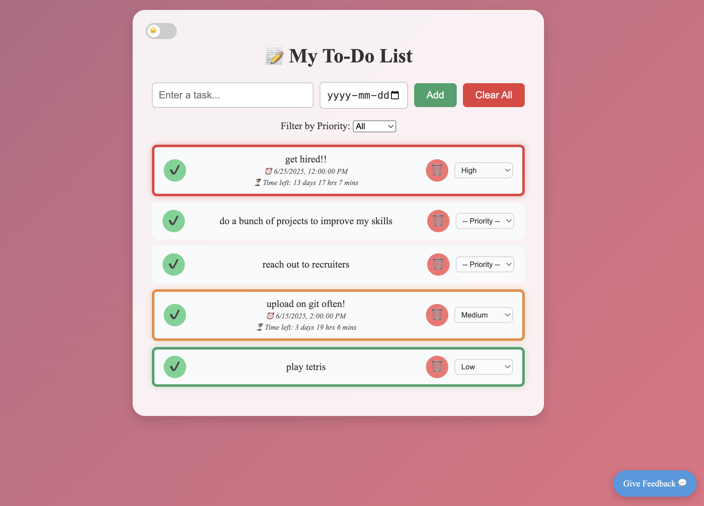

# 📝 To-Do List Web App

A sleek and responsive to-do list app built with vanilla HTML, CSS, and JavaScript. Supports dynamic task management with due dates, live countdowns, priority filters, theme toggle (🌞/🌙), and a feedback modal.

## 🔧 Features
- ✅ Add, complete, delete tasks
- ⏰ Set due dates with live "time left" display
- 🟢 Priority-based color coding (High/Medium/Low)
- 🌗 Toggle between Light and Dark mode with emoji switch
- 💬 Submit user feedback via floating feedback button
- 🧠 LocalStorage persistence for tasks and theme

## 📁 Tech Stack
- HTML5, CSS3 (custom styles & animation)
- Vanilla JavaScript (ES6)
- LocalStorage for saving tasks & theme

## 📸 Preview

## 🚀 Getting Started
1. Clone the repo or download ZIP
2. Open `index.html` in your browser
3. Start managing your tasks effortlessly!

## 👤 Author
Built by [Manavi]([https://github.com/yourusername](https://github.com/Manavi-03)) — aspiring software engineer and problem solver.

